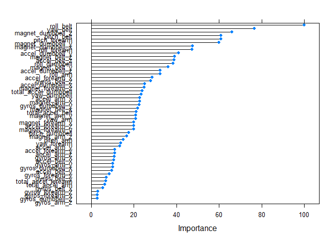

# Machine Learning Project


## Background
Using devices such as Jawbone Up, Nike FuelBand, and Fitbit it is now possible to collect a large amount of data about personal activity relatively inexpensively. These type of devices are part of the quantified self movement – a group of enthusiasts who take measurements about themselves regularly to improve their health, to find patterns in their behavior, or because they are tech geeks. One thing that people regularly do is quantify how much of a particular activity they do, but they rarely quantify how well they do it. In this project, your goal will be to use data from accelerometers on the belt, forearm, arm, and dumbell of 6 participants. They were asked to perform barbell lifts correctly and incorrectly in 5 different ways. More information is available from the website here: http://groupware.les.inf.puc-rio.br/har (see the section on the Weight Lifting Exercise Dataset).  

## Data Loading and Cleaning

Downloading data from website and save in work directory, and then loading traning and testing datasets into R


```r
library(caret)
library(randomForest)
library(e1071)
training<- read.csv("pml-training.csv",na.string=c(""," ",NA))
testing<- read.csv("pml-testing.csv",na.string=c(""," ",NA))
```

There are 19622 observation with 160 variables in training dataset and the dimension of testing dataset is 20 X 160. However, most variables do not have any data (all NAs), so that we need to select useful variables which withour any missing values (NA) for analysis. Moreover, the first 7 colnames are identifier (ID variables) of observations which should not include for building models. There are 53 variables (predictors) remaining in the data set.


```r
#select variables without missing values
colNoNA<- apply(training,2,function(x) sum(is.na(x))) ==0
trainingNoNA<- training[,colNoNA] 
testingNoNA<- testing[,colNoNA]
#remove id variables
train<- trainingNoNA[,-c(1:7)]
test<- testingNoNA[,-c(1:7)]
```
Selecting 80% of data as training set and 20% as validation set from training data, so that the project can design as:

- 15699 observations in training set
- 3923 observations in validation set
- 20 observations in testing set


```r
set.seed(1234)
inTrain<- createDataPartition(y=train$classe,p=0.8,list=F)
trainset<-train[inTrain,]
validationset<- train[-inTrain,]
```


## Prediction Model

Fitting the model by random forest method


```r
fit<- train(classe~.,data=trainset,tuneGrid=data.frame(mtry=3),trControl=trainControl(method="none"))
predVal<- predict(fit,validationset)
confusionMatrix(validationset$classe,predVal)
```

```
## Confusion Matrix and Statistics
## 
##           Reference
## Prediction    A    B    C    D    E
##          A 1115    1    0    0    0
##          B    1  757    1    0    0
##          C    0    5  679    0    0
##          D    0    0    9  634    0
##          E    0    0    0    0  721
## 
## Overall Statistics
##                                         
##                Accuracy : 0.996         
##                  95% CI : (0.993, 0.997)
##     No Information Rate : 0.284         
##     P-Value [Acc > NIR] : <2e-16        
##                                         
##                   Kappa : 0.995         
##  Mcnemar's Test P-Value : NA            
## 
## Statistics by Class:
## 
##                      Class: A Class: B Class: C Class: D Class: E
## Sensitivity             0.999    0.992    0.985    1.000    1.000
## Specificity             1.000    0.999    0.998    0.997    1.000
## Pos Pred Value          0.999    0.997    0.993    0.986    1.000
## Neg Pred Value          1.000    0.998    0.997    1.000    1.000
## Prevalence              0.284    0.194    0.176    0.162    0.184
## Detection Rate          0.284    0.193    0.173    0.162    0.184
## Detection Prevalence    0.284    0.193    0.174    0.164    0.184
## Balanced Accuracy       0.999    0.996    0.992    0.999    1.000
```

The accuracy is 0.997 from the result of confusion matrix which means the model is "good" and efficient.


```r
plot(varImp(fit))
```

 

